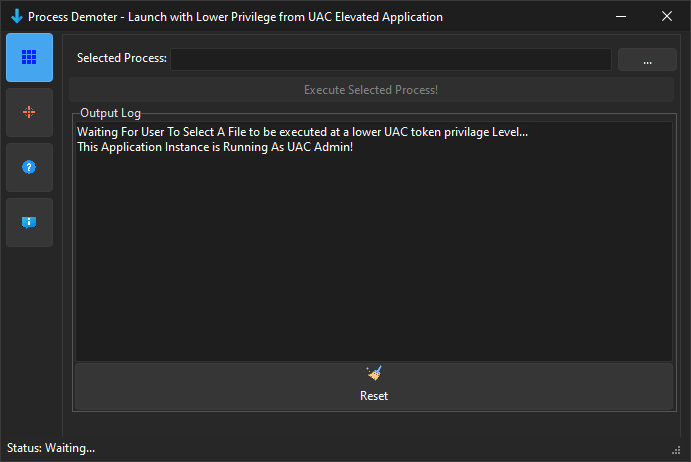

<h1>Process Demoter</h1>

This Delphi VCL application provides a sophisticated solution for executing applications at a lower UAC level through the use of user tokens. Users can conveniently select an `.exe` file and run it with reduced privileges, enhancing overall system performance by deprioritizing resource-intensive applications. This capability of executing programs with lower privileges is also beneficial across various fields of IT, facilitating secure and efficient resource management in diverse operational environments.

<!-- Replace 'Preview.png' with the path to your actual image file -->

  

<h2>Features</h2>
<ul>
  <li><strong>Executable Selection:</strong> Choose any `.exe` file to run at a lower UAC level.</li>
  <li><strong>User Token Utilization:</strong> Execute applications using user tokens to bypass UAC restrictions.</li>
  <li><strong>Real-Time Status:</strong> Get feedback on the execution status of the selected application.</li>
  <li><strong>User-Friendly Interface:</strong> Intuitive design with controls for selecting executables and managing execution.</li>
</ul>

<h2>Installation</h2>
<ol>
  <li><strong>Requirements:</strong> You must have Delphi installed, along with CNPack and Style Controls for compiling the project source.</li>
  <li><strong>Open Delphi Project:</strong> Open the `.dpr` file in the Delphi IDE.</li>
  <li><strong>Compile:</strong> Build the project to generate the executable.</li>
  <li><strong>Run:</strong> Execute the application to start using "Process Demoter."</li>
</ol>

<h2>Usage</h2>
<ol>
  <li><strong>Select an Executable:</strong> Browse and select the `.exe` file you wish to run.</li>
  <li><strong>Run at Lower UAC Level:</strong> Use the provided controls to execute the selected application with reduced privileges.</li>
  <li><strong>Monitor Execution:</strong> Check the status and feedback provided by the application during execution.</li>
</ol>

<h2>Contributing</h2>

Contributions are welcome! If you have suggestions or bug fixes, please fork the repository and submit a pull request.

<h2>License</h2>

This project is provided "as is" without warranty. Use it at your own risk.

## 📧 Contact

Discord: bitmasterxor

Made with ❤️ by BitmasterXor, using Delphi RAD Studio

